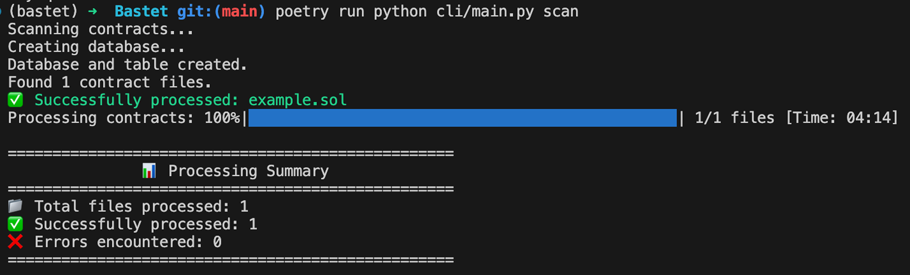

# Bastet


Bastet is a comprehensive dataset of common smart contract vulnerabilities in DeFi along with an AI-driven automated detection process to enhance vulnerability detection accuracy and optimize security lifecycle management.

## Overview

Bastet covers common vulnerabilities in DeFi, including medium- to high-risk vulnerabilities found on-chain and in audit competitions, along with corresponding secure implementations. It aims to help developers and researchers gain deeper insights into vulnerability patterns and best security practices.

In addition, Bastet integrates an AI-driven automated vulnerability detection process. By designing tailored detection workflows, Bastet enhances AI's accuracy in identifying vulnerabilities, with the goal of optimizing security lifecycle management—from development and auditing to ongoing monitoring.

We strive to improve overall security coverage and warmly welcome contributions of additional vulnerability types, datasets, or improved AI detection methodologies.
Please refer to our [Contributing Guidelines](CONTRIBUTING.md).
Together, we can drive the industry's security development forward.

```
Bastet/
│── cli/                        # Python CLI package
│   │── __init__.py
│   │── main.py                 # CLI entry point
│   │── commands/               # CLI commands
│   │   │── <module>/
│   │   │   │── __init__.py     # CLI routing only, logic will define below
│   │   │   │── <function>.py
│── dataset/                    # dataset location
│   │── catogory/               # Legacy: wait for refactor
│   │   ├── (Type)/
│   │   │   ├── (Scenario)/
│   │   │   │   ├── on-chain-vulnerabilities/
│   │   │   │   ├── audit-competitions-findings/
│   │   │   │   ├── secure-implementations/
│   │   │   │   ├── README.md
│   │── scan_queue/             # default directory of contracts which need to be scanned by CLI
│   │   │── <file>.sol
│   │── source_code/            # default directory of file recorded in dataset.csv, for evaluation
│   │   │── <file>.sol
│   │── dataset.csv             # dataset sheet, provide ground truth.
│── n8n_workflows/              # n8n workflow files
│   │── <file>.json             # workflow for analyzing the smart contracts
│── docker-compose.yaml
│── README.md
│── poetry.lock
│── pyproject.toml
│── .gitignore

```

### Features

- Recursive scanning of `.sol` files in specified directories
- Automatic database creation and schema setup
- Integration with n8n workflows via webhooks
- Detailed processing summary and error reporting
- Results stored in PostgreSQL for further analysis
- A dataset for evaluate the prompt
- A cli interface to trigger evaluate workflow
- Python file formatter: Black

## How to install

### Local n8n Setup

**Prerequisites**

- [Python](https://www.python.org/) 3.10 or higher
- [Docker](https://www.docker.com/) installed on your machine
- [Docker Compose](https://docs.docker.com/compose/) installed on your machine
- [Poetry](https://python-poetry.org/) for package management, if you want to follow our instruction the version should< 2.0.0

**Installation Steps**

**_Video tutorial_**

[](https://www.youtube.com/watch?v=ouQ0zSDU3pM)

1. Setup Python environment:

```bash
# Initialize virtual environment and install dependencies
poetry shell
poetry install
```

2. Configure environment variables in `.env`:

```bash
cp .env.example .env
```

Update the environment variables in `.env` file if needed.

3. Start n8n and database:

```bash
docker-compose -f ./docker-compose.yml up -d
```

4. Access the n8n dashboard, Open your browser and navigate to `http://localhost:5678`

5. (First time only) Setup owner account, activate free n8n pro features

6. Click the user icon at the bottom left → Settings → Click the **n8n API** in the sidebar → Create an API key → Label fill Bastet → Expiration select "No Expiration" (If you want to set an expiration time, select it) → Copy the API key and paste it to `N8N_API_KEY` in `.env` file, because the API key will not be visible after creation, you can only create it again → Click Done.

7. Back to the homepage (http://localhost:5678/home/workflows)

8. Click **Create Credential** in the arrow button next to the Create Workflow button → Fill in "n8n" in the input → You will see "n8n API" and select it, click Continue → API Key fill in the API key you just created, Base URL fill in http://host.docker.internal:5678/api/v1 -> click the Save button and you will see Connection tested successfully message -> click the **Details** in sidebar and copy the value of the **ID** field and paste it to `N8N_API_CREDENTIAL_ID` in `.env` file.

9. Based on previous step, Create OpenAi credentials, create a new credential with your OpenAi Key. and copy the value of the **ID** field and paste it to `N8N_OPENAI_CREDENTIAL_ID` in `.env` file.

10. Import the workflow by executing the following code

**Before the setup, make sure you fill the N8N_API_KEY, N8N_API_CREDENTIAL_ID, N8N_OPENAI_CREDENTIAL_ID in `.env` file.**

```bash
poetry run python cli/main.py init
```

You will see the Main workflow and the Sub workflow(We call it processor) you selected with "processor" tag in the homepage.

11. Turn on the switch button of Main workflow and the Sub workflow in the homepage.

## Usage

### Scan Multiple Contracts with Multiple Processor Workflows



The main script `scan` will recursively scan all `.sol` files in the specified directory:

```bash
poetry run python cli/main.py scan
```

The script will scan all contracts in the `dataset/scan_queue` directory using the processor workflows that you have activated by turning on their respective switch buttons.

> you can use flag `--help` for detail information of flag you can use

### Scan Single Contract with Single Processor Workflow

1. Go into Processor workflow you want to scan.
2. Click the **Chat** button on the bottom and input the contract content.

### Evaluation


1. import the workflow you want to evaluate

> The output of the workflow need to follow the following json schema.

```json
{
  "type": "array",
  "items": {
    "type": "object",
    "properties": {
      "Summary": {
        "type": "string",
        "description": "Brief summary of the vulnerability"
      },
      "Severity": {
        "type": "string",
        "items": {
          "type": "string",
          "enum": ["High", "Medium", "Low"]
        },
        "description": "Severity level of the vulnerability"
      },
      "Vulnerability Details": {
        "type": "object",
        "properties": {
          "File Name": {
            "type": "string",
            "description": "File name where the vulnerability exists"
          },
          "Function Name": {
            "type": "string",
            "description": "Function name where the vulnerability is found"
          },
          "Description": {
            "type": "string",
            "description": "Detailed description of the vulnerability"
          }
        },
        "required": ["File Name", "Function Name", "Description"]
      },
      "Code Snippet": {
        "type": "array",
        "items": {
          "type": "string"
        },
        "description": "Code snippet showing the vulnerability",
        "default": []
      },
      "Recommendation": {
        "type": "string",
        "description": "Recommendation to fix the vulnerability"
      }
    },
    "required": [
      "Summary",
      "Severity",
      "Vulnerability Details",
      "Code Snippet",
      "Recommendation"
    ]
  },
  "additionalProperties": false
}
```

> The trigger point should be a webhook and this workflow should be activated (by clicking the switch at n8n home page)

> You may refer `n8n_workflow/slippage_min_amount.json`

2. run the command

```bash
poetry run python cli/main.py eval
```

> you can use flag `--help` for detail information of flag you can use

#### Demo Case Setup

1. import `slippage_min_amount.json` to your n8n service.

2. provide the openAI credential for the workflow `slippage_min_amount` you just create.

3. make the workflow active

4. run

```bash
poetry run python cli/main.py eval
```

you shell get the confusion metrics. like this

```
+----------------+---------+
| Metric         |   Value |
+================+=========+
| True Positive  |      16 |
+----------------+---------+
| True Negative  |      27 |
+----------------+---------+
| False Positive |       2 |
+----------------+---------+
| False Negative |      13 |
+----------------+---------+
```

Note: the number shell be difference since the answer of LLM model is not stable, the answer here is created by gpt-4o-mini


## Conference

|  Date  |Conference Name |    Topic  |  Slide |  
| ---- | ---- | ---- | ---- |
| 2025-04-02|ETH TAIPEI 2025 | Exploring AI’s Role in Smart Contract Security | [Eth Taipei 2025](https://github.com/OneSavieLabs/Bastet/Slide/Eth_Taipei_2025.pptx.pdf)  | 


## Disclaimer

Bastet is for research and educational purposes only. Anyone who discovers a vulnerability should adhere to the principles of Responsible Disclosure and ensure compliance with applicable laws and regulations. We do not encourage or support any unauthorized testing, attacks, or abusive behavior, and users assume all associated risks.

## License

Apache License 2.0
